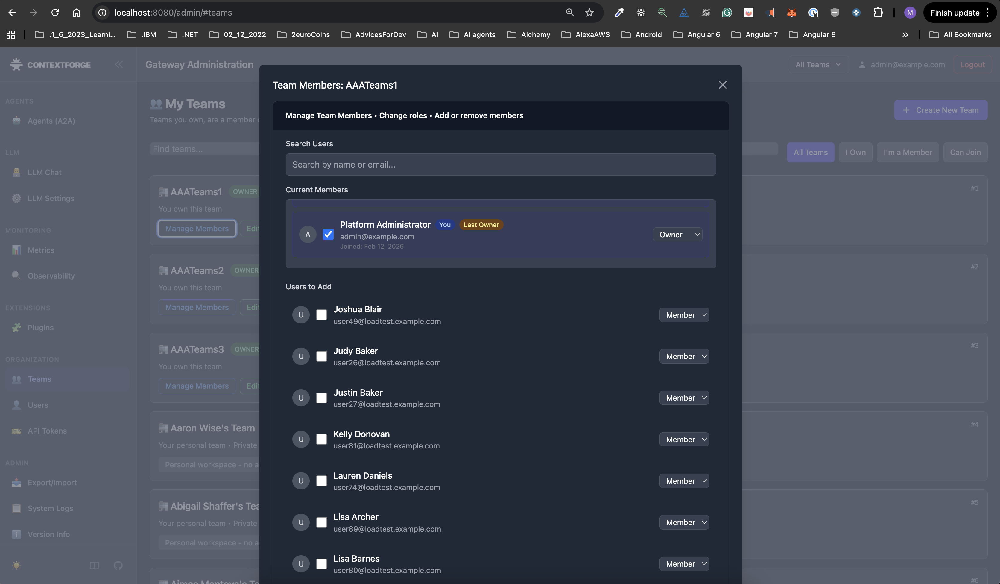
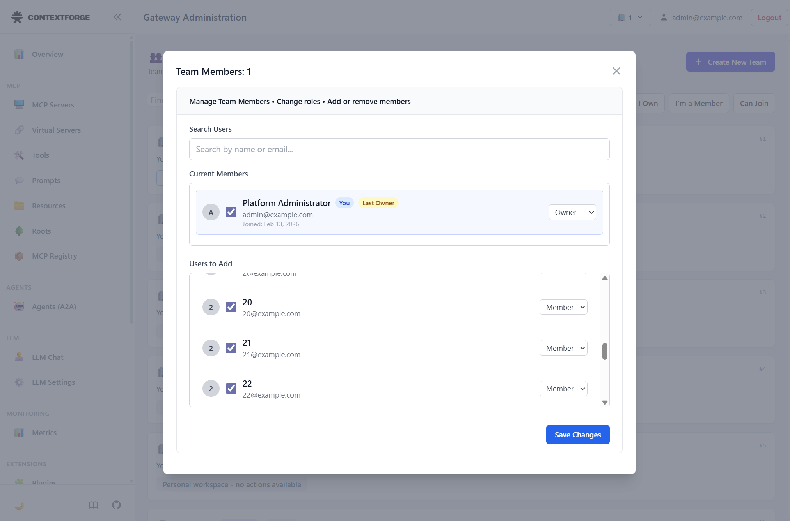

# IBM/mcp-context-forge — PR #2937 — Constrained Team Manage Members modal height to viewport

**Repo:** [IBM/mcp-context-forge](https://github.com/IBM/mcp-context-forge)
**PR:** [#2937](https://github.com/IBM/mcp-context-forge/pull/2937)
**Issue:** [#2930](https://github.com/IBM/mcp-context-forge/issues/2930)
**Status:** merged
**Area:** bugfix / UI
**Stack:** HTML, CSS, Tailwind
**Impact:** Users can now scroll and save changes in the Team Manage Members modal without the modal expanding beyond the viewport.

---

## Context
MCP Context Forge is an IBM project with an admin dashboard for managing teams, agents, and MCP servers. The Teams page includes a "Manage Members" modal that allows administrators to add/remove users and change roles. When teams have a large user pool (20+), the modal's "Users to Add" list grows significantly.

## Problem
- **Symptom:** The Team Manage Members modal expanded beyond the viewport as users scrolled through the "Users to Add" section, pushing the "Save Changes" button off-screen and making it inaccessible.
- **Root cause:** The modal container had no max-height constraint and used `overflow-hidden`, allowing the inner list to grow unbounded and push the modal beyond the visible area.
- **Scope:** Only the Team Manage Members modal was affected. The issue became noticeable with 20+ users in the system.

## Reproduction (before fix)
1. Navigate to `http://localhost:8080/admin/#teams` with 20+ users in the system
2. Select a team's "Manage Members" option
3. Scroll down within the "Users to Add" section
4. Observe the modal expanding beyond the viewport
- **Expected:** The modal maintains a consistent height with a scrollable list and a visible "Save Changes" button
- **Actual:** The modal expands automatically, pushing the "Save Changes" button off-screen

### Before

### After

## Fix / Changes
- Capped the modal at `90vh` with `overflow-y: auto` using inline styles (the airgapped Tailwind build does not support arbitrary bracket values)
- Removed the problematic `overflow-hidden` from the modal container
- Increased inner list containers from `max-h-32` to `max-h-64` for improved usability while still maintaining scroll containment

## Testing / Verification
**Checks**
- Confirmed modal stays within viewport with 25+ users in the "Users to Add" list
- Verified the "Save Changes" button remains visible and functional at all times
- Tested scrolling behavior inside the member list and the "Users to Add" list independently
- No Python code changes — lint, unit tests, and coverage unaffected

## Risks / Trade-offs
- **Risk:** Minimal — CSS-only changes scoped to a single modal component.
- **Mitigation:** Used a two-level scroll containment strategy (outer modal cap + inner list max-height) to avoid edge cases. Manual testing confirmed correct behavior.

## Review notes
- **Feedback:** Reviewer validated the approach as a "clean, well-scoped fix" and confirmed the two-level scroll containment was the right strategy.
- **Iteration:** Rebased onto main with no conflicts before merge.

## Takeaways
- When working with airgapped or restricted build systems, inline styles can be a pragmatic fallback when framework-specific syntax isn't available.
- Modal height issues often only surface with realistic data volumes — worth testing with larger datasets.
