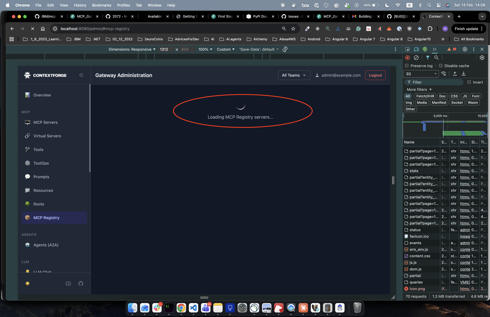
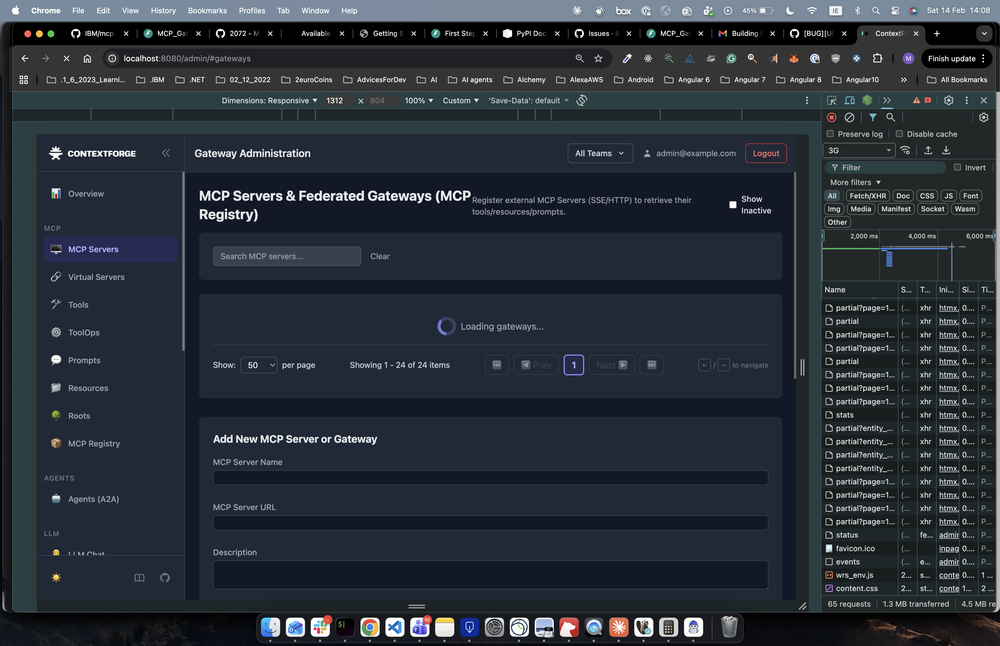

# IBM/mcp-context-forge — PR #2950 — Standardized loading indicators across admin pages

**Repo:** [IBM/mcp-context-forge](https://github.com/IBM/mcp-context-forge)
**PR:** [#2950](https://github.com/IBM/mcp-context-forge/pull/2950)
**Issue:** [#2946](https://github.com/IBM/mcp-context-forge/issues/2946)
**File:** `mcpgateway/templates/admin.html`
**Status:** Merged
**Area:** UI
**Stack:** HTML, Tailwind CSS

---

## Impact

Four admin pages now display the same indigo SVG loading spinner already used on Gateways and Tools, eliminating visual inconsistency during page loads.

## Problem

**User-facing symptom:** Loading indicators looked different on every admin page — MCP Registry showed a CSS border spinner, Teams showed a pulsing text message with an extra note, API Tokens had misaligned spacing, and System Logs displayed plain "Loading..." text. Users saw a different loading pattern each time they navigated between pages.

**Root cause:** Each page section in `admin.html` was implemented independently with its own loading markup. No one had gone back to align them with the standard pattern established on the Gateways and Tools pages.

**Scope:** MCP Registry, Teams, API Tokens, and System Logs. Gateways and Tools already used the correct pattern.

### Before

### After

## Fix

Single file changed: `mcpgateway/templates/admin.html`. All four sections updated to the same indigo SVG spinner pattern (`flex items-center justify-center p-4`, `h-8 w-8` SVG, `ml-2`, `text-indigo-600 dark:text-indigo-400`).

| Page | What changed |
|---|---|
| MCP Registry | Replaced CSS `border`-based spinner with standard SVG spinner |
| Teams | Replaced `h-5` spinner + `animate-pulse` text + extra note message with standard spinner |
| API Tokens | Corrected spacing from `p-8`/`ml-3` to `p-4`/`ml-2` to match standard layout |
| System Logs | Replaced plain "Loading..." text with standard SVG spinner |

## Verification

Ran locally via Docker Compose. HTML-only change — no Python code was modified, so the project's lint, unit test, and coverage pipelines are unaffected (there is nothing to regress).

**Steps:**
1. Started the stack with `docker compose up`
2. Hard-reloaded each affected page (MCP Registry, Teams, API Tokens, System Logs)
3. Confirmed every page now shows the identical indigo SVG spinner
4. Verified dark mode renders `text-indigo-400` correctly
5. Cross-checked against the existing Gateways and Tools pages as the reference

## Review notes

- **Reviewer response:** Approved the cleanup, then additionally applied the same standardization to the Users section loading indicator for full consistency across the remaining page.
- **Merge:** Rebased onto main with no conflicts.
- **Why this approach is safe:** The change is purely presentational HTML/CSS inside a single template file. No backend logic, API behavior, or data flow was altered. Each replacement swaps markup to match an already-proven pattern, so the risk of regression is effectively zero.
