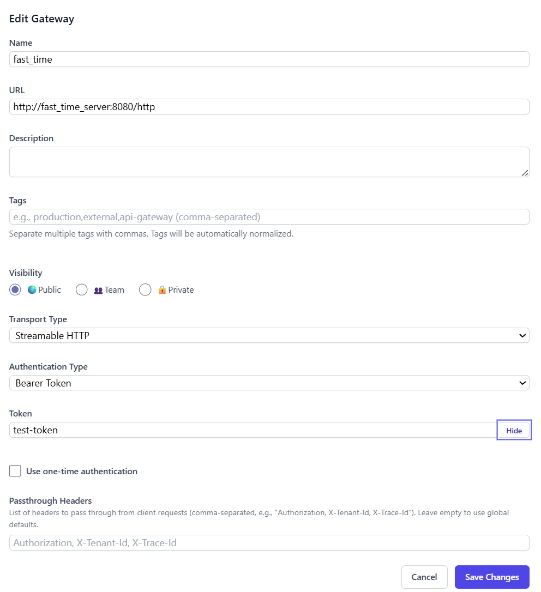

# IBM/mcp-context-forge — PR #2980 — Restored admin gateway token reveal toggle broken by masked() regression

**Repo:** [IBM/mcp-context-forge](https://github.com/IBM/mcp-context-forge)
**PR:** [#2980](https://github.com/IBM/mcp-context-forge/pull/2980)
**Issue:** [#2968](https://github.com/IBM/mcp-context-forge/issues/2968)
**Status:** confirmed
**Area:** bugfix / security
**Stack:** Python, HTML, HTMX
**Impact:** Admins can once again use the "Show" toggle to reveal gateway tokens, passwords, and header values in the admin UI without credential data being silently wiped.

---

## Context
MCP Context Forge's admin dashboard includes a "Show" toggle on the Gateways page that lets administrators reveal masked credentials (tokens, passwords, header values). The `GatewayRead` schema includes a `masked()` method that controls field visibility.

## Problem
- **Symptom:** Clicking the "Show" toggle on the Gateways admin page no longer revealed token/password/header values — all fields remained masked.
- **Root cause:** The `masked()` method in `GatewayRead` was unconditionally setting all `_unmasked` fields to `None`, which broke the admin UI toggle. The permission-gated admin endpoint received wiped values instead of the real ones.
- **Scope:** Only the admin UI gateway "Show" toggle was affected. The security model remained intact — non-admin endpoints were already correctly masked.

## Reproduction (before fix)
1. Navigate to admin Gateways page
2. Click "Show" to reveal a gateway's token
3. Token field remains masked/empty
- **Expected:** The token value is revealed to the admin
- **Actual:** The token field stays masked because `masked()` wiped the underlying value

### After

## Fix / Changes
- Added an opt-in `preserve_unmasked` parameter (default `False`) to the `masked()` method
- Only the admin `admin_get_gateway` endpoint opts in with `include_unmasked=True`
- All other callers remain unaffected — the default behavior is unchanged

## Testing / Verification
**Checks**
- `pytest tests/unit/mcpgateway/test_admin.py` — 775/775 passed
- `pytest tests/unit/mcpgateway/test_schemas.py` — 65/65 passed
- `pytest --doctest-modules mcpgateway/services/gateway_service.py` — 25/25 passed
- Manual test: Admin UI "Show" toggle working

## Review notes
- **crivetimihai** (Feb 19): "Clean, minimal fix. The preserve_unmasked parameter defaults to False for safety, and only the admin UI's admin_get_gateway endpoint opts in with include_unmasked=True."
- **crivetimihai** (Feb 21): "Thanks @omorros — important security fix. Preventing gateway token reveal in the admin UI closes a credential exposure vector. LGTM."
- **Labels:** bug, MUST (P1), security
- **Milestone:** Release 1.0.0-GA
