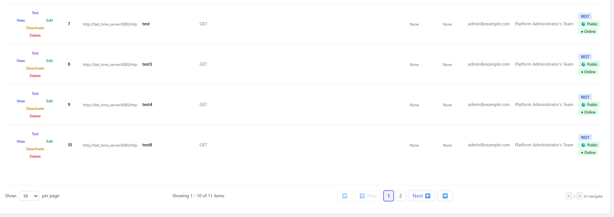
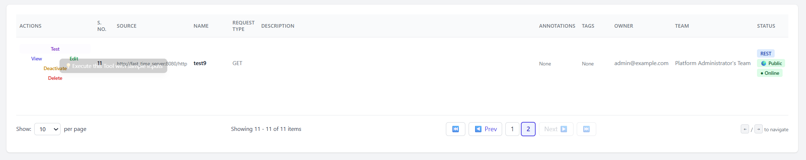

# IBM/mcp-context-forge — PR #3047 — Fixed pagination controls not rendering after filtering

**Repo:** [IBM/mcp-context-forge](https://github.com/IBM/mcp-context-forge)
**PR:** [#3047](https://github.com/IBM/mcp-context-forge/pull/3047)
**Issue:** [#3039](https://github.com/IBM/mcp-context-forge/issues/3039)
**Status:** confirmed
**Area:** bugfix / UI
**Stack:** HTML, JavaScript, Alpine.js, HTMX
**Impact:** Pagination controls (page info text, navigation buttons) now render correctly after filtering or searching any admin table.

---

## Context
MCP Context Forge's admin panel uses HTMX for partial page updates and Alpine.js for client-side interactivity. When filtering table data, HTMX performs an out-of-band (OOB) swap of the pagination controls div.

## Problem
- **Symptom:** After applying a search filter or tag filter on any admin table, the pagination controls (page numbers, navigation buttons) disappeared completely.
- **Root cause:** Two issues combined: (1) Alpine.js's MutationObserver didn't reliably detect and initialize new `x-data` components after HTMX OOB swaps. (2) The `pagination_controls.html` template defaulted to `innerHTML` swap, but partial templates return full elements, causing nested elements with duplicate IDs.
- **Scope:** All admin tables with pagination were affected after any filtering operation.

### After

## Reproduction (before fix)
1. Navigate to any admin table (e.g., Servers)
2. Enter a search term in the filter box
3. Observe that pagination controls disappear
- **Expected:** Pagination controls update to reflect filtered results
- **Actual:** Pagination controls vanish entirely

## Fix / Changes
- `admin.js`: Added an `htmx:afterSettle` listener that explicitly calls `Alpine.initTree()` on uninitialized pagination controls (guarded by `_x_dataStack` absence check to avoid double-initialization). Selector `[id$="-pagination-controls"]` is well-scoped.
- `admin.html`: Set `hx_swap='outerHTML'` for 5 initial pagination renders
- 7 partial templates (tools, servers, resources, prompts, gateways, agents, tokens): Added ``

## Testing / Verification
**Checks**
- Verified pagination controls appear after filtering on all admin tables
- Confirmed Alpine.js components initialize exactly once (no double-init)
- Verified page navigation works correctly after filtering

## Review notes
- **Feedback:** Maintainer approved — described it as a "clean fix for the Alpine.js / HTMX OOB race condition" and confirmed the `_x_dataStack` guard ensures idempotent initialization.
